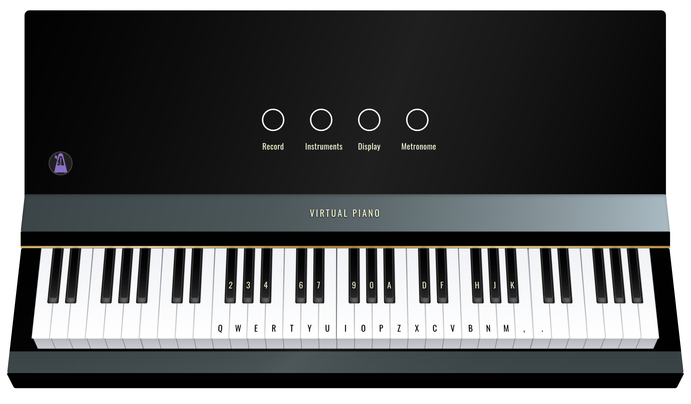
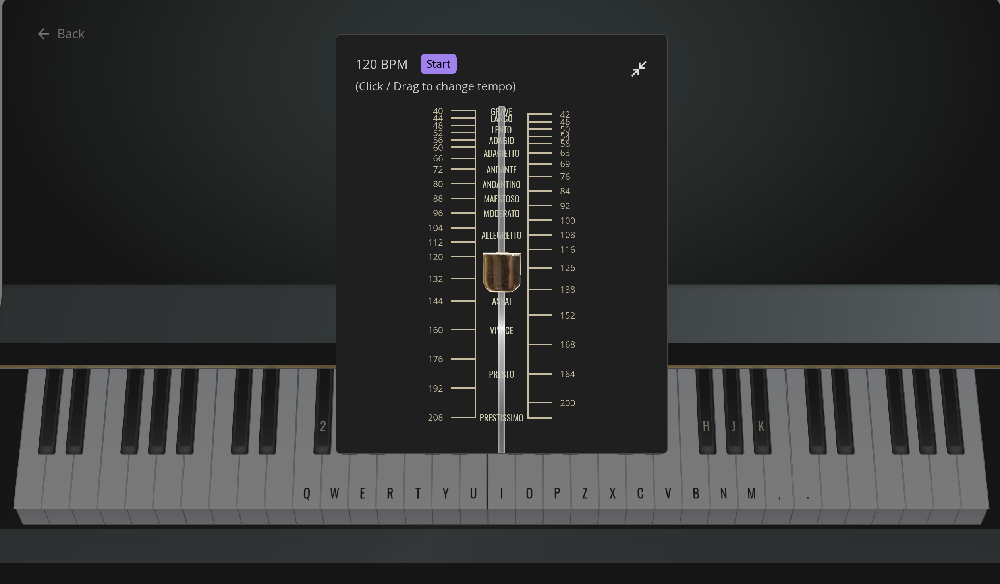

# Virtual Piano
A virtual piano made with React; supports the violin, guitar, flute, etc. Play and record at the [Demo Site](https://florence-yuan.github.io/virtual-instrument/).

## Make a Recording

Make a recording by pressing the circle.

Go to 'My Recordings' to view your recordings. You may download, delete, and rename your recordings.

## Instruments

[View full list of available instruments here.](https://raw.githubusercontent.com/danigb/soundfont-player/master/names/musyngkite.json)

## Metronome

Click / drag to change the tempo.  Click 'start' to begin, and click the resize button to minimize the metronome window.

## Dependencies
- smplr 0.16.3 (for sound samples)
- vexflow 5.0.0 (for music score rendering)